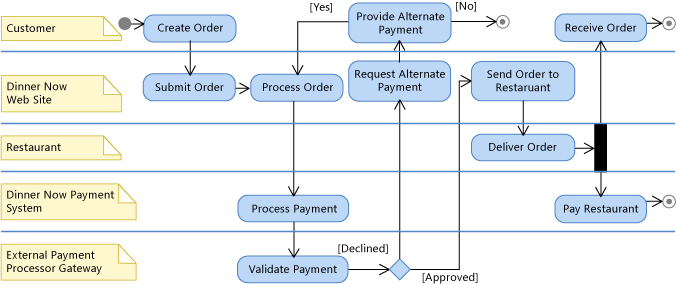

# 案例研究：可视化建模与软件开发
{:.no_toc}

* 目录
{:toc}

根据 [Scenario: Change your design using visualization and modeling](https://docs.microsoft.com/zh-cn/visualstudio/modeling/scenario-change-your-design-using-visualization-and-modeling?view=vs-2015)  修改

**案例目标**

展示 UML 建模支持软件开发可视化、提升开发效率等方面的优势。包括：

* 明确软件需求和业务流程
* 可视化现有代码组织
* 跟踪需求变更
* 变更设计，且保持设计与代码的一致
* 使用 Scrum 控制开发

## 1、案例概述

本案例介绍了从两个虚构的公司的软件：Dinner Now 和 Lucerne。 Dinner Now 在西雅图提供基于 Web 的送餐服务。 客户可以在 Dinner Now 网站上订餐和付费。 订单随后会发送给相应的本地餐馆以便其配送餐点；Lucerne Publishing 是一家位于纽约的公司，在网上和网下经营了多项业务。 例如，他们运营了一家网站，客户可以在这个网站上发表自己对餐馆的评论。

Lucerne 最近收购了 Dinner Now （类似美团和大众点评的合并），并希望进行以下变革：

* 将餐馆点评功能添加到 Dinner Now 来整合其网站。
* 将 Dinner Now 的支付系统更换为 Lucerne 的系统。
* 将 Dinner Now 服务推广到整个区域。

Dinner Now 使用 SCRUM 和 eXtreme Programming。 他们的测试覆盖率非常高，不受支持的代码非常少。 他们通过创建小巧而有效的系统版本，然后逐步添加功能，从而最大程度地减小风险。 他们通过短期而频繁的迭代来开发代码。 这样一来，他们便自信地接受更改、经常重构代码并避免“初期进行大量设计”。

Lucerne 保留了一组很复杂的大型系统，其中有一些系统已有 40 年以上的历史。 由于旧版代码很复杂且涉及范围很广，因此他们对更改非常谨慎。 他们遵循一个更严格的开发过程，希望设计详细的解决方案并记录开发过程中进行的设计和更改。

这两个团队都使用 Visual Studio 中的建模工具来帮助自己开发满足用户需求的系统。 他们借助 Team Foundation Server 和其他工具来计划、整理和管理其工作。

## 1.1 UML模型与软件开发过程

| UML 模型 | 软件需求建模 | 业务过程建模 | 系统架构与设计 | 代码组织与可视化 |主要作用|
|---------|:-----------:|:-----------:|:-------------:|:---------------:|------|
| 用例图  | √ | | | | 系统支持的用户目标和系统服务 |
| 活动图  | √ | √ | | | 业务流程中操作和参与者之间的工作流 |
| 类图（领域模型） | √ | √ | | | 系统中存储和交换数据的类型及其关系与约束 |
| 顺序图（系统交互图） | √ | √ | √ | | 系统或参与者之间的交互序列 |
| 包图（逻辑架构） | | | √ | | 系统的上层体系结构 |
| 包图（命名空间与依赖） | | | √ | √ | 映射代码中的依赖关系和其他关系 |
| 部署图（物理架构） | | | √ | | 软件产品与系统部署 |
| 组件图 | | | √ | √ | 系统的组件、组件的接口、端口和关系 |
| 类图 |  |  | √ | √ | 类、对象可视化代码模型 |
| 通讯图/顺序图 |  |  | √ | | 对象、或组件之间的交互序列 |

## 1.2 在开发过程中使用模型

* 如何使用模型
    - 建立需求模型，减少自然语言的多义性；利用模型保持需求的一致性和完整性。具体参考：[建立用户需求模型](https://docs.microsoft.com/zh-cn/visualstudio/modeling/model-user-requirements?view=vs-2015)
    - 建立设计模型，用架构模型沟通系统整体解决方案，用设计模式沟通系统局部解决方案。具体参考：[应用程序的体系结构建模](https://docs.microsoft.com/zh-cn/visualstudio/modeling/model-your-app-s-architecture?view=vs-2015)
* 在迭代中使用模型
    - 聚焦每个迭代的新增与变更需求与设计
    - 利用模型指导看板开发工作项
    - 利用模型指导看板测试工作项
    - 估计工作量与进度

## 2、案例研究

### 2.1 描述现有系统现状

Lucerne 希望了解有关 Dinner Now 业务流程的详细信息。 他们创建了以下 UML 图，以便更轻松地表达他们所掌握的有关 Dinner Now 的信息：

| UML图 | 意图描述 |
|------|-------|
| 活动图（多泳道） | 描述客户创建订单到支付完成的业务过程 |
| 用例图 | 描述该业务涉及的客户目标与系统服务 |
| 类图 | 讨论中使用的业务实体和术语以及这些实体之间的关系 |

**1、UML 活动图**

Lucerne 用活动图介绍了客户在 Dinner Now 网站上创建订单时的步骤。在此版本中，注释元素用于识别角色，行用于创建 “泳道”，泳道可按角色整理业务步骤：

**2、UML 用例图**

Lucerne 创建了以下用例图，以便理解 Dinner Now 网站上执行的任务及其执行者：

